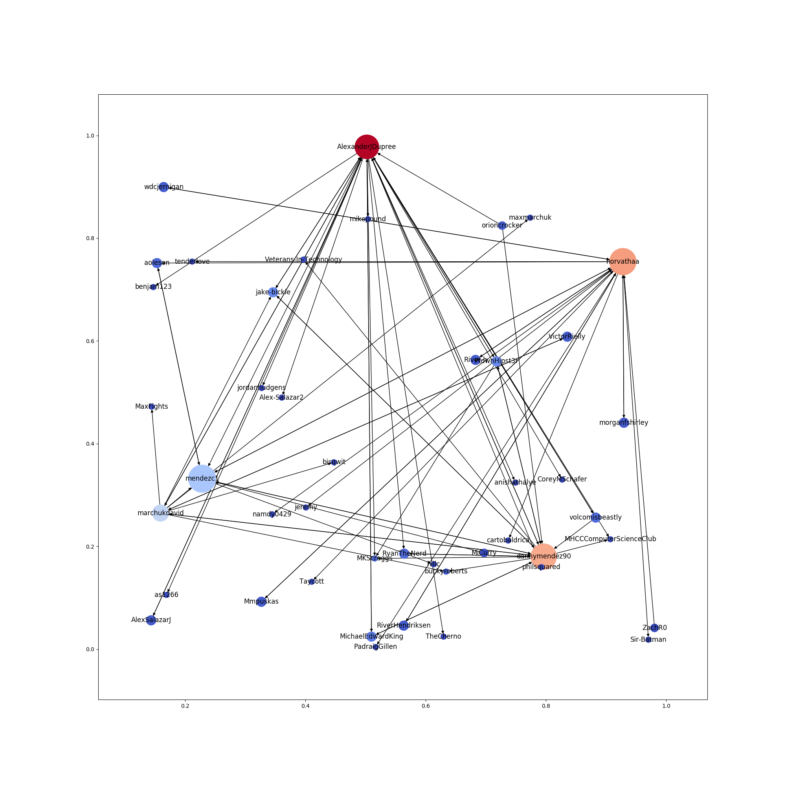
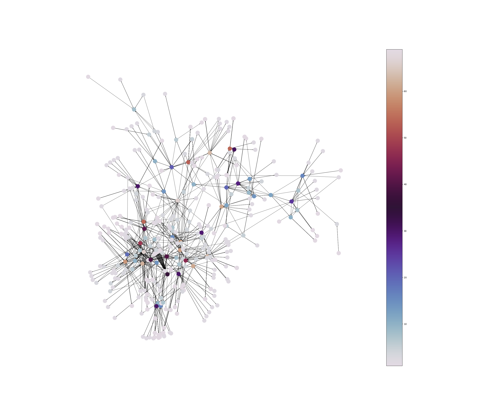

# GitHubNetwork

Visualize your GitHub social network as a directed graph!

[](https://circleci.com/gh/AlexanderJDupree/GithubNetwork)
[](https://www.codacy.com/app/AlexanderJDupree/GithubNetwork?utm_source=github.com&amp;utm_medium=referral&amp;utm_content=AlexanderJDupree/GithubNetwork&amp;utm_campaign=Badge_Grade)
[](https://github.com/AlexanderJDupree/GitHubNetwork/blob/master/LICENSE)

## Introduction

The **GitHubNetwork** is a command line application that helps crawl and visualize your social network here on GitHub! GitHubNetwork utilizes the networkx library in conjunction with GitHub API calls to crawl your follower/following lists and generate a directed graph. This graph is nodes are positioned with according to a specified visualization method and saved to a .png file. The graph data is also saved in a separate file and can be reused with other visualization and analysis tools. This project was an educational exercise designed to expand my knowledge with such tools like networkx, matplotlib, pip, argparse, and the GitHub API. The orignal idea for this project came about during my networks and society class. 

## Getting Started

### Prerequisites

GitHubNetwork requires [python3](https://www.python.org/downloads/) and *pip* to install and run the application. GitHubNetwork has been tested on python versions 3.6 and greater. Older versions may or may not work with GitHubNetwork. 

The GitHub API limits unauthenticated users to 60 requests per hour. So if you plan on generating a sizeable graph you will need to provide your GitHub credentials. This is done with basic authentication and environment variables. Simply run the following lines in a terminal or store them in your .bash_profile (or wherever you store your environment variables).

```
export GITHUB_USER="Your GitHub username"
export GITHUB_PASS="Password for your account"
```

Note: Even with basic authentication, the GitHub API rate limits requests to 5000 per hour. So, don't expect to be able to graph the entire GitHub social network. 

### Clone this Repo

To install the **GitHubNetwork** application first you will need to clone the repo:

```
git clone https://github.com/AlexanderJDupree/GitHubNetwork.git
```

Then run the install script!

```
cd GitHubNetwork && ./install.sh
```

Now you can run the application with:

```
github-network some_username
```

Note: The file *install.sh* will utilize *pip* to install the dependencies and install the application itself. This is done with the `--user` and `-e` flags, meaning that it should install into your /home/.local/bin in an editable format. If the command `github-network` is not found then /home/.local/bin is probably not in your $PATH.

Also, if you don't want to install the application you can always use the *runner.py* file to execute the application directly from source like this:

```
python runner.py
```

### Future Distributions

In the future I plan to ship **GitHubNetwork** with [pypi](https://pypi.org/). As well as instructions to build the newsfeed as a self-contained binary.  

### Usage 

**GitHubNetwork** comes with quite a variety of options to specify the layout and format of your graph. The only required argument is a GitHub username, but options like arrowsize, output file format, coloring can all be designated. To get a full list of options run:

```
github-network --help
```

Here are a couple of examples with my GitHub profile and the resulting images:

Here I am specifying the max number of nodes to be 45, arranged randomly, colored with the coolwarm colormap, with the axis displayed, and with each node labeled with the username. 

```
github-network alexanderjdupree -m 45 -v random -c coolwarm --labels=true --axis=true
```
This command generated this image:



Heres another example for 1000 nodes, an arrowsize of 5, line width of 60%, node sizes normalized, a figure size of 30 by 25, arranged by the kamada-kawai algorithm, with a color bar added for the twilight colormap.

```
github-network alexanderjdupree  -d 6 -m 1000 -v kamada-kawai -c twilight --arrowsize=5 --bar=true --normalize=true --width=.6 -f 30 25
```

Which results in this image:



As you can see, things can get messy very quick! That's why that along with the .png file the graph itself can be saved in a variety of formats. By default it is saved as 'network.graphml' and can be used in other visualization and analysis tools of your choosing. 

Currently, the node sizes are scaled by their betweeness centrality values and the color relates to the nodes degree. If you want to normalize all the node sizes you can run the app with the '--normalize=True' command. In the future I will add a variety of options to scale the node sizes/colorschemes.

## What's in this Repo?

Besides all the source files, there are a suite of unit tests as well. If you feel like contributing just make sure you add/update the unit tests in the test/ folder and open a pull request with the passing tests. To run the unit tests just cd into the project folder and type:

```
python -m unittest
```

If 0 tests are ran, or there are failed imports then you are likely in the wrong folder. The unittest command should be run at the top level of the project directory
## Contributing

All are welcome to contribute to make GitHubNetwork even better! If you'd like to contribute code or have a feature request just raise an issue or email me and we can discuss it!

## Built With

* [GitHub API](https://developer.github.com/v3/) - Powered by the GitHub API
* [networkx](https://networkx.github.io/) - Graph Analysis and visualizer
* [matplotlib](https://matplotlib.org/index.html) - Plotting Library
* [requests](http://docs.python-requests.org/en/master/) - HTTP for Humans
* [tqdm](https://github.com/tqdm/tqdm) - Awesome and intuitive progress bar library

## License

This project is licensed under the MIT License - see the [LICENSE.md](https://raw.githubusercontent.com/AlexanderJDupree/GithubNetwork/master/LICENSE) file for details
